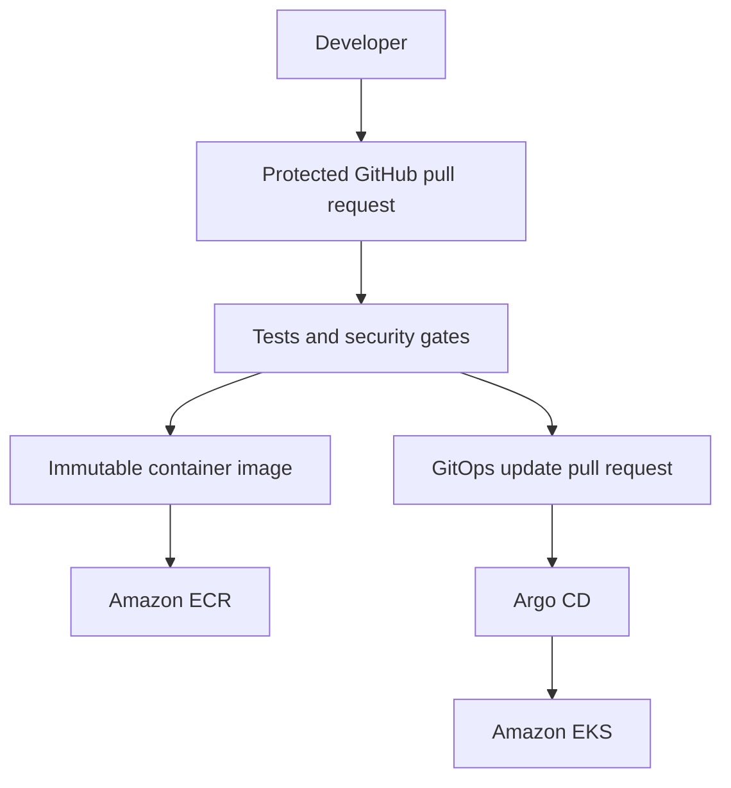

# P01 — AI Job Platform

> **Status:** Phase 0 — Project Foundation  
> **Current state:** In Progress  
> **Project type:** DevOps-first portfolio project  
> **Production readiness:** Not production-ready

## Overview

The AI Job Platform is a production-oriented DevOps portfolio project built around a minimal job-matching application.

The application is a realistic workload for practicing infrastructure automation, secure software delivery, Kubernetes operations, observability, reliability, and disaster recovery.

Application development is intentionally limited. The primary focus is designing, deploying, securing, operating, monitoring, and recovering the platform.

## Business Workload

The planned application will:

- Accept synthetic job descriptions through an API.
- Store jobs and synthetic candidate profiles.
- Compare candidate skills with job requirements.
- Return a deterministic and explainable match result.
- Queue background analysis tasks.
- Expose health, readiness, and metrics endpoints.

Only synthetic data will be used. Real resumes, contact information, and automatic job applications are outside the project scope.

## Primary Engineering Goals

The project is designed to demonstrate:

- Professional Git and GitHub workflows.
- Secure container image creation.
- Local integration using Docker Compose.
- Continuous integration using GitHub Actions.
- DevSecOps and software supply-chain controls.
- Infrastructure as Code using Terraform.
- AWS infrastructure and Amazon EKS.
- Kubernetes workload packaging using Helm.
- GitOps deployment using Argo CD.
- Metrics, logs, traces, dashboards, and alerts.
- SLI, SLO, error-budget, and incident-response practices.
- Backup restoration and disaster-recovery validation.
- Cloud cost controls and safe resource teardown.

## Planned Delivery Flow



GitHub Actions will authenticate to AWS using OpenID Connect rather than long-lived AWS access keys.

## Planned Technology Stack

| Area | Technology | Status |
| --- | --- | --- |
| API workload | FastAPI | Planned |
| Database | PostgreSQL | Planned |
| Queue | Redis | Planned |
| Worker | Python background worker | Planned |
| Containers | Docker and Docker Compose | Planned |
| CI | GitHub Actions | Planned |
| Security scanning | Gitleaks and Trivy | Planned |
| Infrastructure | Terraform and AWS | Planned |
| Container registry | Amazon ECR | Planned |
| Kubernetes | Local Kubernetes and Amazon EKS | Planned |
| Packaging | Helm | Planned |
| GitOps | Argo CD | Planned |
| Metrics | Prometheus | Planned |
| Dashboards | Grafana | Planned |
| Logging and tracing | OpenTelemetry with justified backends | Planned |

Tools will be introduced progressively. A tool will not be added only to increase the number of technologies listed in the project.

## Project Roadmap

- [ ] Phase 0 — Project Foundation
- [ ] Phase 1 — Application Baseline
- [ ] Phase 2 — Containers and Local Operations
- [ ] Phase 3 — Continuous Integration and Security
- [ ] Phase 4 — Terraform and AWS Foundation
- [ ] Phase 5 — Local Kubernetes Baseline
- [ ] Phase 6 — Local GitOps
- [ ] Phase 7 — Temporary Amazon EKS Environment
- [ ] Phase 8 — Observability and SRE
- [ ] Phase 9 — Reliability and Disaster Recovery
- [ ] Phase 10 — Portfolio and Interview Evidence

A phase is completed only after its acceptance criteria and required evidence have been reviewed.

## Repository Structure

```text
.
├── .github/
│   └── pull_request_template.md
├── docs/
│   ├── adr/
│   │   └── 0001-repository-strategy.md
│   └── charter.md
├── .gitignore
├── LICENSE
├── README.md
└── SECURITY.md
```

Additional directories will be created only when their first implemented and validated files are introduced.

## Security and Cost Boundaries

- Secrets must not be stored in Git, images, logs, or Terraform configuration.
- Real candidate or personal data must not be used.
- AWS access will use short-lived identity and least-privileged IAM.
- No EKS cluster, NAT Gateway, load balancer, RDS instance, or ElastiCache resource will be created without an approved cost estimate and teardown plan.
- Security findings will not be silently ignored.
- Backups will not be considered successful until restoration is tested.

## Current Progress

| Phase | Task | Status |
| --- | --- | --- |
| Phase 0 | Repository initialization | Completed |
| Phase 0 | Project documentation baseline | In Progress |
| Phase 1 | Application implementation | Not Started |

## Documentation

Project decisions, validation evidence, operational procedures, security controls, and recovery exercises will be documented progressively as they are implemented and tested.

Documentation will not claim unfinished work as completed.

## License

This project is licensed under the [MIT License](LICENSE).