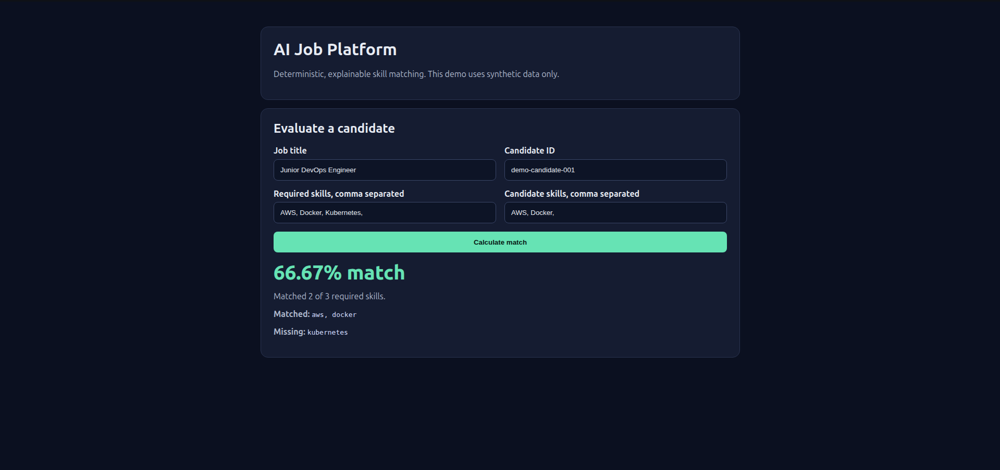
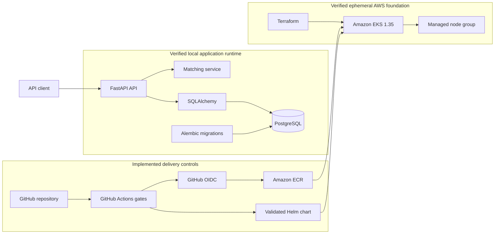
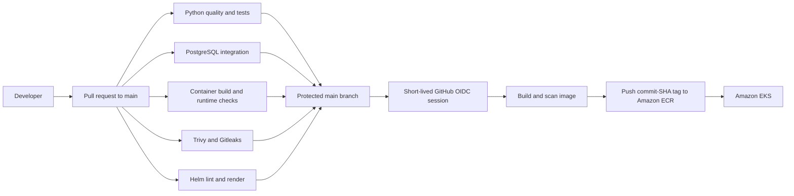
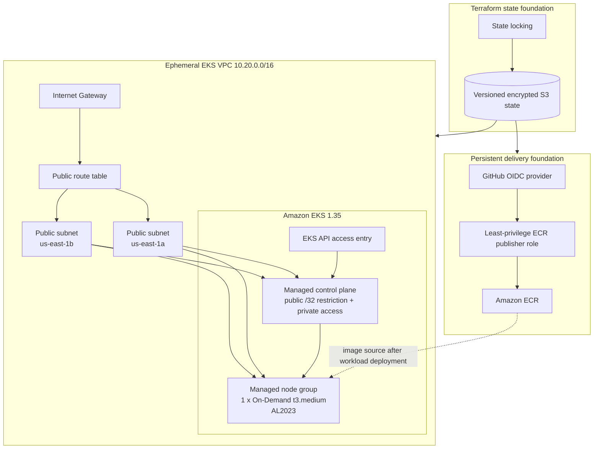

# P01 - AI Job Platform

[](https://github.com/SamehYahia/ai-job-platform/actions/workflows/quality.yml)

> **Status:** Phase 5 runtime deployment verified for a same-day demo<br>
> **Current state:** FastAPI and PostgreSQL, secure CI, GitHub OIDC and ECR publishing, Helm packaging, Terraform-managed ephemeral Amazon EKS 1.35, and a Helm-deployed application workload<br>
> **Project type:** DevOps-first portfolio project<br>
> **Production readiness:** Production-oriented demo, not production-ready - the EKS environment is intentionally temporary and still lacks several production controls

## Overview

AI Job Platform is a DevOps-focused portfolio project built around a small,
realistic job-matching API. The application is intentionally focused so the
repository can demonstrate how a service is built, tested, secured, packaged,
and progressively delivered through a production-oriented engineering
lifecycle.

The verified platform currently includes:

- A FastAPI backend with deterministic and explainable matching.
- PostgreSQL persistence, SQLAlchemy, and Alembic migrations.
- A hardened container and Docker Compose local runtime.
- GitHub Actions quality, integration, container, security, and Helm gates.
- Terraform-managed remote state, AWS resources, IAM, and Amazon ECR.
- Short-lived GitHub Actions authentication to AWS through OpenID Connect.
- A Helm chart for Kubernetes packaging.
- An ephemeral Amazon EKS 1.35 network, control plane, and managed node group.
- A Helm-deployed EKS workload with an explicit Alembic migration Job.
- A lightweight GUI for demonstrating explainable matching through the deployed API.

Only synthetic data is used. Real resumes, personal information, and automated
job applications are outside the current project scope.

## Verified Current State

| Area | Verified state |
| --- | --- |
| Application | FastAPI API, deterministic matching, persistence, migrations, and health endpoints implemented |
| Local runtime | Docker Compose application and PostgreSQL stack validated |
| CI and DevSecOps | Python, PostgreSQL, container, Trivy, Gitleaks, and Helm checks implemented |
| Terraform state | Protected, versioned, encrypted S3 remote state implemented |
| AWS delivery identity | GitHub OIDC trust restricted to this repository's `main` branch |
| Container registry | Amazon ECR repository and immutable commit-SHA publishing implemented |
| Kubernetes packaging | Helm chart linting and rendering implemented in CI |
| EKS network | Dedicated VPC, Internet Gateway, two public subnets, routing, and security groups created |
| EKS control plane | Amazon EKS 1.35 control plane created and reported `ACTIVE` |
| EKS compute | One On-Demand `t3.medium` AL2023 managed node created and reported `ACTIVE` |
| Cluster health | Node reported `Ready`; VPC CNI, CoreDNS, and kube-proxy pods reported healthy |
| Terraform reconciliation | Post-deployment plan reported no changes |
| Workload on EKS | Helm release deployed and application rollout verified |
| Database migration lifecycle | Helm pre-upgrade migration Job completed successfully in 9 seconds |
| Runtime health | Application Pod and PostgreSQL Pod reported `Running`; health endpoints returned HTTP 200 |
| Demo GUI | Browser demo served through Kubernetes port-forward and returned an explainable match result |

The live AWS validation proves the infrastructure foundation and a working
application deployment path. The cluster is a temporary development environment
and may be destroyed between learning or validation sessions to control cost.

## Demo Evidence

The final same-day demo validated the deployed workload through Helm, Kubernetes,
HTTP health checks, and the browser GUI.

| Evidence | Result |
| --- | --- |
| Helm release | `ai-job-platform` deployed in namespace `ai-job-platform-dev`, revision `4` |
| Migration hook | `ai-job-platform-ai-job-platform-migrate` completed `1/1` in `9s` |
| Application Pod | `Running`, `1/1` ready, `0` restarts |
| PostgreSQL Pod | `Running`, `1/1` ready, `0` restarts |
| Service | ClusterIP service on port `80` |
| Rollout | Deployment successfully rolled out |
| Health checks | `/health/live` and `/health/ready` returned HTTP `200` |
| GUI | Match demo returned `66.67%` with matched and missing skills |

Demo assets:

- [Demo presentation](docs/presentation/ai-job-platform-demo-deck.pptx)
- [Project walkthrough and interview guide](docs/project-walkthrough.md)
- [Project walkthrough PDF](output/pdf/ai-job-platform-project-walkthrough.pdf)
- [LinkedIn post draft](docs/linkedin-post.md)
- [GUI match screenshot](docs/assets/demo/gui-match-demo.png)
- [EKS workloads screenshot](docs/assets/demo/eks-workloads-pods.png)
- [Runtime validation screenshot](docs/assets/demo/runtime-validation-terminal.png)



## Current Platform Architecture

This diagram separates the application, delivery controls, and AWS runtime used
for the demo deployment.



The application can run locally through Docker Compose and was also deployed to
EKS for the final demo. PostgreSQL is the runtime database, while isolated
automated tests may use SQLite when an external database is not required.

## CI/CD and Image Publishing Flow

Pull requests to `main` must pass the repository's quality and security gates.
Image publishing occurs only after code reaches `main` and all required jobs
succeed.



### Enforced CI and security controls

- Dependency compatibility, Ruff linting and formatting, and fast tests.
- PostgreSQL integration testing after Alembic migrations.
- Docker Compose validation, image build, health checks, and non-root runtime verification.
- Trivy filesystem, configuration, dependency, and final-image scanning.
- Gitleaks repository and history scanning.
- Strict Helm linting and manifest rendering.
- Protected `main` branch with required status checks and pull requests.
- Pinned GitHub Actions revisions and restricted workflow permissions.
- ECR publication by immutable Git commit SHA after successful `main` validation.

GitHub Actions does not use long-lived AWS access keys. Its IAM trust policy
accepts the expected audience and only the `main` branch subject for this
repository. The publishing policy is limited to ECR authentication and image
upload operations for the application repository.

## AWS and EKS Infrastructure

Terraform separates the persistent AWS foundation from the disposable EKS
development environment.



### Verified EKS configuration

| Property | Value |
| --- | --- |
| Environment | Ephemeral development |
| AWS Region | `us-east-1` |
| Kubernetes version | `1.35` |
| VPC CIDR | `10.20.0.0/16` |
| Subnets | Two public subnets across `us-east-1a` and `us-east-1b` |
| API access | Private access enabled; public access restricted to one administrator `/32` CIDR |
| Authentication | EKS API authentication mode with an explicit access entry |
| Node group capacity | One On-Demand node, minimum/desired/maximum `1/1/1` |
| Instance and OS | `t3.medium`, `AL2023_x86_64_STANDARD` |
| Validation | Control plane and node group `ACTIVE`; node `Ready`; system pods healthy |
| Drift check | Terraform reported no changes after deployment |

## Kubernetes and Helm Packaging

The chart under `deploy/helm/ai-job-platform` currently defines:

- A Deployment, ClusterIP Service, and dedicated ServiceAccount.
- Configurable image repository and tag.
- A required existing Kubernetes Secret reference for `DATABASE_URL`.
- Liveness and readiness probes.
- Non-root execution, runtime-default seccomp, dropped Linux capabilities,
  disabled privilege escalation, and a read-only root filesystem.
- An explicit resource configuration interface without invented default requests
  or limits; values must be based on measured workload behavior.

CI proves that the chart lints and renders. It does not prove live cluster
behavior by itself, so the project also captures runtime evidence from EKS.

For the final demo, Helm installed the chart into EKS and ran the Alembic
migration as a pre-upgrade hook before completing the application rollout.

## API Endpoints

| Method | Endpoint | Purpose |
| --- | --- | --- |
| `GET` | `/health/live` | Confirms that the API process is running |
| `GET` | `/health/ready` | Confirms that the database accepts queries |
| `POST` | `/api/v1/matches/evaluate` | Evaluates and persists a match |
| `GET` | `/` | Opens the lightweight demo GUI |
| `GET` | `/docs` | Opens the interactive OpenAPI documentation |

## Local Development

Docker Compose is the primary local runtime environment.

```bash
export POSTGRES_DB=ai_job_platform
export POSTGRES_USER=postgres
export POSTGRES_PASSWORD=local-development-only

docker compose config --quiet
docker compose up --build --detach --wait
curl --fail http://127.0.0.1:8000/health/live
curl --fail http://127.0.0.1:8000/health/ready
```

The interactive API documentation is available at
`http://127.0.0.1:8000/docs`.

Stop the environment without deleting its database volume:

```bash
docker compose down
```

To intentionally delete the local PostgreSQL volume as well:

```bash
docker compose down --volumes
```

The example credentials above are for local development only. Do not reuse
them in CI, Kubernetes, or AWS.

### Local Python checks

```bash
python -m venv .venv
source .venv/bin/activate
python -m pip install --requirement requirements-dev.txt
python -m pip check
ruff check .
ruff format --check .
python -m pytest -m "not integration"
```

Apply database migrations with:

```bash
python -m alembic upgrade head
```

## Technology Status

| Area | Technology | Status |
| --- | --- | --- |
| API and persistence | FastAPI, SQLAlchemy, Alembic, PostgreSQL | Implemented and tested |
| Containers | Docker and Docker Compose | Implemented and tested |
| CI and security | GitHub Actions, Ruff, Pytest, Trivy, Gitleaks | Implemented |
| Infrastructure as Code | Terraform | Implemented for current AWS foundation |
| Remote state | Amazon S3 with encryption, versioning, public-access blocking, and locking | Implemented |
| AWS authentication | GitHub Actions OIDC and IAM | Implemented |
| Container registry | Amazon ECR | Implemented and integrated with CI |
| Kubernetes packaging | Helm | Implemented and CI-validated |
| Kubernetes platform | Ephemeral Amazon EKS 1.35 | Foundation deployed and verified |
| Workload deployment | Helm installation into EKS | Deployed and verified |
| Migration lifecycle | Helm pre-upgrade Alembic Job | Implemented and verified |
| Demo GUI | Static HTML served by FastAPI | Implemented and verified |
| GitOps | Argo CD or equivalent | Planned, not implemented |
| Observability | Metrics, logs, dashboards, and alerting | Planned, not implemented |
| SRE | SLI, SLO, error budget, and failure testing | Planned, not implemented |
| Disaster recovery | Backup, restore, failover, and recovery tests | Planned, not implemented |

## Delivery Roadmap

```mermaid
flowchart LR
    P0["Phase 0<br/>Foundation and governance<br/>Completed"] --> P1["Phase 1<br/>Application and persistence<br/>Completed"]
    P1 --> P2["Phase 2<br/>Containers and local runtime<br/>Completed"]
    P2 --> P3["Phase 3<br/>CI and DevSecOps<br/>Completed"]
    P3 --> P4["Phase 4<br/>Terraform, AWS, OIDC, ECR, Helm<br/>Completed"]
    P4 --> P5A["Phase 5A<br/>EKS foundation<br/>Verified"]
    P5A --> P5B["Phase 5B<br/>Workload deployment<br/>Verified"]
    P5B --> P6["Phase 6<br/>GitOps<br/>Planned"]
    P6 --> P7["Phase 7<br/>Observability and SRE<br/>Planned"]
    P7 --> P8["Phase 8<br/>Reliability and DR<br/>Planned"]
```



### Completed and verified

- [x] Project foundation, governance, API, matching, and persistence.
- [x] Docker containerization and local PostgreSQL runtime.
- [x] GitHub Actions CI, security scanning, and branch protection.
- [x] Terraform AWS foundation and protected remote state.
- [x] GitHub Actions OIDC and Amazon ECR image publishing.
- [x] Kubernetes Helm packaging and CI validation.
- [x] Ephemeral EKS network and restricted control-plane access.
- [x] EKS 1.35 managed control plane and managed node group.
- [x] Live cluster validation and post-deployment Terraform drift check.
- [x] ECR image delivery for the demo application image.
- [x] Helm release deployed to EKS.
- [x] Alembic migration Job completed before rollout.
- [x] Application Pod, PostgreSQL Pod, service, health checks, and GUI validated.

### Next

- [ ] Commit the demo GUI, Helm migration hook, README update, and demo presentation.
- [ ] Record a short demo video using the captured evidence.
- [ ] Publish a LinkedIn post that describes the project as production-oriented.
- [ ] Tear down the temporary EKS environment after evidence is preserved.

### Planned

- [ ] Implement GitOps only after the manual Helm delivery path is verified.
- [ ] Add metrics, centralized logs, dashboards, alerts, and operational runbooks.
- [ ] Define measured resource requests and limits, SLI/SLO targets, and error budgets.
- [ ] Test failure handling, backup restoration, recovery objectives, and teardown.

A phase is complete only after implementation, validation, and evidence review.

## Production-Readiness Caveats

[Warning] The repository demonstrates a verified production-oriented development
deployment; it is not a production platform. Current limitations include:

- The node group contains one node, so it provides no workload redundancy.
- Worker nodes use public subnets; private worker networking and controlled
  egress are not implemented.
- The public Kubernetes API endpoint is restricted to one administrator `/32`,
  but a private-only operational access path is not implemented.
- Pod resource requests and limits are intentionally unset until measurements exist.
- No ingress controller, DNS, TLS certificate, or external traffic path exists.
- No Kubernetes NetworkPolicy or application-specific cluster RBAC is complete.
- GitOps, deployment promotion, automated rollback, and progressive delivery are
  not implemented.
- Centralized metrics, logs, traces, dashboards, alerts, SLI/SLOs, and error
  budgets are not implemented.
- Backup, restore, RPO/RTO, failover, and disaster-recovery testing are not
  implemented.
- Multi-environment isolation, autoscaling, disruption budgets, and topology
  spread have not been validated.
- Cost controls rely on the environment remaining temporary; ongoing cloud cost
  must be reviewed before every deployment window.

## Security and Cost Boundaries

- Never commit credentials, state files, plan files, Kubernetes Secrets, or real
  candidate data.
- Use short-lived AWS sessions and least-privilege IAM.
- Treat HIGH and CRITICAL actionable security findings as blocking.
- Estimate chargeable resources before deployment and verify teardown afterward.
- Preserve and protect Terraform state; review every plan before applying it.
- Do not describe a backup as recovery until restoration is tested.
- Do not describe the platform as production-ready without validated security,
  reliability, observability, recovery, operations, and cost controls.

## Repository Structure

```text
.
├── .github/workflows/quality.yml
├── alembic/
├── app/
├── deploy/helm/ai-job-platform/
├── docs/
├── infra/
│   ├── bootstrap/terraform-state/
│   ├── eks-dev/
│   └── terraform/
├── scripts/
├── tests/
├── compose.yaml
├── Dockerfile
├── README.md
└── SECURITY.md
```

Security expectations are defined in [`SECURITY.md`](SECURITY.md), with
implementation details in [`docs/security.md`](docs/security.md). Architecture
decisions are stored under [`docs/adr/`](docs/adr/).

Documentation is updated as implementation progresses and must not claim
unfinished infrastructure or operational controls as complete.

## License

This project is licensed under the [MIT License](LICENSE).
