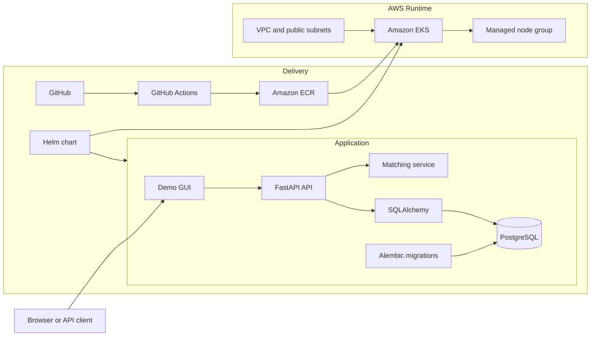

# P01 - AI Job Platform Project Walkthrough

## 1. Project Summary

P01 is a DevOps-first portfolio project built around a small AI Job Platform.
The application itself is intentionally simple: it evaluates how well a
candidate's skills match a job's required skills and returns an explainable
score.

The engineering goal was larger than the application logic. The project was
used to practice the lifecycle of building, testing, packaging, deploying,
troubleshooting, validating, documenting, and safely tearing down a
cloud-native service.

Recommended positioning:

```text
Production-oriented Kubernetes deployment demo for an AI Job Platform.
```

Avoid this positioning:

```text
Fully production-ready platform.
```

The project has strong production-style practices, but it still lacks several
controls required for a real production system, including managed database
operations, ingress with TLS, centralized observability, alerting, autoscaling,
backup automation, and multi-node workload resilience.

## 2. Business Problem

Hiring teams often need to understand why a candidate appears suitable for a
role. A black-box score is not enough for a useful technical demo. This project
therefore uses deterministic matching so every result can explain:

- the required skills,
- the candidate skills,
- the matched skills,
- the missing skills,
- and the final match percentage.

The business logic stays small so the repository can focus on DevOps and SRE
evidence rather than a large product surface.

## 3. Final Verified State

The final demo validated the application on Amazon EKS through Helm.

| Area | Verified result |
| --- | --- |
| Application | FastAPI service with deterministic matching |
| Demo UI | Lightweight GUI served at `/` |
| Database | PostgreSQL-backed runtime persistence |
| Migrations | Alembic executed by Helm pre-upgrade Job |
| Container registry | Application image pushed to Amazon ECR |
| Kubernetes platform | Amazon EKS 1.35 ephemeral development cluster |
| Deployment method | Helm upgrade/install |
| Runtime health | Live and ready endpoints returned HTTP 200 |
| Migration evidence | Migration Job completed successfully in 9 seconds |
| Workload evidence | API Pod and PostgreSQL Pod ran with 0 restarts |
| CI evidence | Python, PostgreSQL, Docker, Helm, secret scan, and Trivy checks passed |

## 4. Architecture

The project has three layers:

- application layer,
- delivery and security layer,
- cloud runtime layer.



## 5. Phase-by-Phase Story

### Phase 0 - Foundation and Scope

The project started with a clear portfolio goal: build a realistic but small
service that could prove DevOps delivery practices.

Key decisions:

- keep the product surface intentionally small,
- use synthetic data only,
- avoid real resumes and personal data,
- build in phases with evidence after each phase,
- document only what was implemented and validated.

### Phase 1 - Application and Persistence

The first implementation created the FastAPI backend, matching logic, schemas,
database models, persistence layer, and health checks.

Implemented endpoints:

| Method | Endpoint | Purpose |
| --- | --- | --- |
| `GET` | `/health/live` | Confirms the API process is running |
| `GET` | `/health/ready` | Confirms the database can answer a query |
| `POST` | `/api/v1/matches/evaluate` | Evaluates and persists a match result |
| `GET` | `/` | Opens the lightweight demo GUI |
| `GET` | `/docs` | Opens OpenAPI documentation |

Production value:

- health checks support Kubernetes probes,
- deterministic matching supports explainability,
- persistence proves the app is more than a stateless toy endpoint,
- Alembic gives the project a repeatable database migration path.

### Phase 2 - Container and Local Runtime

The service was containerized and connected to PostgreSQL through Docker
Compose for local validation.

Production value:

- the app runs in a repeatable container environment,
- local PostgreSQL catches database issues earlier,
- the container runs as a non-root user,
- startup uses migrations before serving traffic.

### Phase 3 - CI and Security Gates

GitHub Actions was added to validate every pull request.

Implemented gates:

- Ruff linting and formatting,
- fast Python tests,
- PostgreSQL integration tests,
- Docker image build and runtime health validation,
- Trivy image and filesystem scans,
- Gitleaks secret scanning,
- Helm linting and rendering.

Production value:

- pull requests cannot bypass core quality checks,
- secrets are scanned before merge,
- container and IaC risks are caught before runtime,
- Helm rendering catches manifest problems before deployment.

### Phase 4 - AWS Delivery Foundation

Terraform created the persistent AWS delivery foundation.

Implemented resources:

- encrypted and versioned S3 remote state,
- state locking,
- Amazon ECR repository,
- GitHub OIDC provider,
- least-privilege role for image publishing.

Production value:

- no long-lived AWS keys are required in GitHub Actions,
- infrastructure is reproducible,
- image publishing is tied to validated code,
- Terraform state is protected and recoverable.

### Phase 5A - EKS Foundation

Terraform then created an ephemeral EKS development environment.

Implemented resources:

- dedicated VPC,
- two public subnets,
- Internet Gateway and route table,
- EKS 1.35 control plane,
- managed node group,
- EKS access entry.

Verified evidence:

- control plane active,
- managed node group active,
- node ready,
- CoreDNS, VPC CNI, and kube-proxy running,
- Terraform plan reported no drift after deployment.

Production value:

- the platform can run workloads on Kubernetes,
- access is controlled through EKS access configuration,
- the environment is temporary to control cost.

### Phase 5B - Runtime Deployment

The application was deployed to EKS using Helm.

Implemented runtime pieces:

- Deployment,
- ClusterIP Service,
- ServiceAccount,
- liveness and readiness probes,
- non-root Pod security settings,
- read-only root filesystem for the application container,
- explicit database migration Job using Helm hooks,
- PostgreSQL development manifest for the demo environment.

Final runtime evidence:

| Evidence | Result |
| --- | --- |
| Helm release | Deployed |
| Helm revision | 4 |
| Migration Job | Complete, 1/1 |
| Migration duration | 9 seconds |
| Application Pod | Running, 1/1 ready, 0 restarts |
| PostgreSQL Pod | Running, 1/1 ready, 0 restarts |
| Rollout | Deployment successfully rolled out |
| Health checks | Live and ready returned HTTP 200 |
| GUI | Browser demo returned an explainable 66.67% match |

## 6. Migration Lifecycle

The project originally depended on application startup to run migrations.
That works for a first boot, but it does not model a clear deployment
lifecycle.

The improved lifecycle is:

```text
helm upgrade/install
pre-upgrade migration Job
alembic upgrade head
successful migration
application rollout proceeds
```

If the migration Job fails, Helm fails the upgrade before the application
rollout continues. This is the right operational behavior for a deployment
that depends on database schema compatibility.

The startup migration is kept temporarily as a safety net for the demo. A
future production version should decide whether to remove it after the Helm
migration lifecycle has enough operational confidence.

## 7. Troubleshooting Story

This project produced useful real-world troubleshooting evidence.

### Issue 1 - Wrong ECR image reference

Symptom:

```text
Helm upgrade failed during the pre-upgrade hook.
```

Root cause:

```text
The migration Job used a placeholder or wrong ECR image URI.
```

Fix:

- confirmed the AWS account ID,
- created or selected the correct ECR repository,
- built and pushed the image,
- reran Helm with the correct image repository and tag,
- added Helm guardrails so empty image values and placeholders fail early.

### Issue 2 - Migration Job timeout

Symptom:

```text
pre-upgrade hooks failed: timed out waiting for the condition
```

Root cause:

```text
The migration Job could not complete because it was using an invalid image.
```

Fix:

- inspected the Job,
- checked the rendered image field,
- verified ECR repository existence,
- pushed a valid image,
- reran Helm successfully.

### Issue 3 - Trivy filesystem failure

Symptom:

```text
CI Quality Gates / Trivy Filesystem failed.
```

Root cause:

```text
The PostgreSQL Kubernetes manifest did not set readOnlyRootFilesystem.
```

Fix:

- enabled `readOnlyRootFilesystem: true`,
- mounted writable `emptyDir` volumes for PostgreSQL data, runtime socket files,
  and temporary files,
- reran the GitHub Actions workflow,
- confirmed the latest CI run passed.

## 8. Security Review

Implemented controls:

- no committed application secrets,
- Kubernetes Secret references instead of literal database credentials,
- non-root application container,
- privilege escalation disabled,
- Linux capabilities dropped for the application and migration containers,
- runtime-default seccomp profile,
- read-only root filesystem for the application and migration containers,
- GitHub OIDC instead of long-lived AWS keys,
- Trivy and Gitleaks in CI,
- ECR image scanning enabled.

Remaining gaps:

- no production-grade secret manager integration yet,
- no NetworkPolicy yet,
- no TLS ingress yet,
- no centralized audit logging strategy yet,
- no signed image or admission control policy yet.

## 9. Reliability and Operations Review

Implemented controls:

- liveness probe,
- readiness probe,
- explicit migration Job,
- rollout validation,
- manual recovery validation after schema loss,
- evidence capture before teardown.

Remaining gaps:

- single-node development cluster,
- no Horizontal Pod Autoscaler,
- no PodDisruptionBudget,
- no multi-AZ production database,
- no automated backup and restore workflow,
- no SLO, alerting, or incident response automation yet.

## 10. Cost and Teardown

The EKS environment is intentionally temporary.

Main cost drivers:

- EKS control plane,
- EC2 worker node,
- EBS volumes,
- NAT Gateway if added in a future version,
- ECR image storage,
- S3 Terraform state storage.

Teardown principle:

```text
Capture evidence first, then destroy temporary compute.
```

Before deleting anything, preserve:

- screenshots,
- final README,
- demo presentation,
- CI results,
- Helm status,
- Kubernetes workload evidence,
- health check evidence.

## 11. Demo Script

Use this flow for a 3 to 5 minute demo.

### Opening

This is P01, an AI Job Platform built as a production-oriented Kubernetes
deployment demo.

The application is intentionally small. It evaluates a candidate against a job
and returns an explainable skill match score.

The value of the project is the delivery lifecycle around the application:
CI, containerization, ECR image delivery, EKS deployment, Helm lifecycle hooks,
health checks, and runtime validation.

### Show the repository

Show the README and explain:

- the project status,
- the demo evidence,
- the architecture,
- the production-readiness caveats.

### Show the application

Open the GUI through port-forwarding and run a match example.

Explain:

- the data is synthetic,
- the matching is deterministic,
- the result shows both matched and missing skills.

### Show Kubernetes

Show:

```bash
kubectl get jobs,pods,svc --namespace ai-job-platform-dev
```

Explain:

- the migration Job completed,
- the application Pod is running,
- PostgreSQL is running for the demo,
- the service is internal through ClusterIP.

### Show Helm

Show:

```bash
helm status ai-job-platform --namespace ai-job-platform-dev
```

Explain:

- Helm manages the release,
- pre-upgrade hooks run database migrations,
- rollout continues only after migration success.

### Show health checks

Show:

```bash
curl http://127.0.0.1:18080/health/live
curl http://127.0.0.1:18080/health/ready
```

Explain:

- liveness proves the API process is alive,
- readiness proves the API can reach the database.

### Close

The project demonstrates practical DevOps and SRE work around a real service:
build, test, scan, package, deploy, troubleshoot, validate, document, and tear
down safely.

## 12. Interview Questions and Talking Points

### Project Overview

**Question:** What did you build?

**Answer:** I built a production-oriented deployment demo for a FastAPI AI Job
Platform. The app performs explainable candidate-to-job skill matching, and the
project focuses on the DevOps lifecycle around it: CI, Docker, ECR, EKS, Helm,
PostgreSQL, Alembic migrations, health checks, and runtime validation.

**Question:** Why did you keep the app small?

**Answer:** The goal was to demonstrate delivery and operations practices, not
to build a large product. A focused app made it easier to prove containerization,
database migrations, Kubernetes deployment, security checks, and recovery
behavior clearly.

### Kubernetes and Helm

**Question:** Why did you use Helm?

**Answer:** Helm gave me a repeatable way to package Kubernetes resources,
configure environment-specific values, and manage upgrade lifecycle behavior.
It also allowed me to add a pre-upgrade migration Job.

**Question:** What problem does the migration Job solve?

**Answer:** It separates database migration from application process startup.
During a Helm upgrade, the migration runs first. If it fails, Helm fails the
upgrade before rolling out the application.

**Question:** Why use readiness and liveness probes?

**Answer:** Liveness tells Kubernetes whether the process is alive. Readiness
tells Kubernetes whether the app can serve traffic safely, including whether
the database dependency is reachable.

### AWS and EKS

**Question:** Why was the EKS cluster temporary?

**Answer:** It was a development and portfolio validation environment. Keeping
it temporary reduced cost and forced evidence capture before teardown.

**Question:** Why use ECR?

**Answer:** ECR provides a private AWS-native registry for application images.
It integrates naturally with EKS and supports image scanning.

**Question:** What did you validate after EKS creation?

**Answer:** I validated the control plane, managed node group, node readiness,
system pods, Terraform drift, Helm deployment, migration Job completion,
application Pod readiness, service discovery, health checks, and GUI behavior.

### CI/CD and Security

**Question:** What CI checks did you add?

**Answer:** Python linting and formatting, fast tests, PostgreSQL integration
tests, Docker build and runtime checks, Trivy scanning, Gitleaks secret scanning,
and Helm lint/render validation.

**Question:** How did you avoid long-lived AWS keys?

**Answer:** I used GitHub OIDC so GitHub Actions can request short-lived AWS
credentials through a restricted IAM role.

**Question:** How did you harden the containers?

**Answer:** The app runs as a non-root user, privilege escalation is disabled,
Linux capabilities are dropped, seccomp uses RuntimeDefault, and the root
filesystem is read-only where the workload supports it.

### Troubleshooting

**Question:** Tell me about a real issue you debugged.

**Answer:** A Helm upgrade failed because the pre-upgrade migration hook timed
out. I inspected the Job and found it was using the wrong ECR image reference.
After correcting the ECR repository, pushing the image, and rerunning Helm, the
migration completed in 9 seconds and the release deployed successfully.

**Question:** What did the Trivy failure teach you?

**Answer:** It caught a Kubernetes hardening gap in the PostgreSQL manifest.
The fix was not just setting `readOnlyRootFilesystem`; PostgreSQL still needed
writable paths, so I mounted explicit temporary volumes for the directories it
must write to.

### Production Readiness

**Question:** Is this production-ready?

**Answer:** No. I describe it as production-oriented. It demonstrates many
production-style practices, but a true production system still needs managed
database operations, TLS ingress, NetworkPolicy, autoscaling, dashboards,
alerts, backup automation, restore testing, and stronger release automation.

**Question:** What would you improve next?

**Answer:** I would replace in-cluster PostgreSQL with managed RDS, add ingress
with TLS, define resource requests from measurements, add metrics and alerts,
implement NetworkPolicy, add backup and restore automation, and introduce
GitOps for deployment promotion.

## 13. STAR Story for Interviews

### Situation

I wanted to build a DevOps portfolio project that demonstrates more than local
application development. The goal was to show how a real service moves through
build, test, containerization, cloud infrastructure, Kubernetes deployment, and
runtime validation.

### Task

I needed to deploy a FastAPI application with PostgreSQL persistence to Amazon
EKS, package it with Helm, manage database migrations safely, and capture
evidence that the system worked.

### Action

I built the application and tests, containerized it, added GitHub Actions
quality and security gates, created AWS infrastructure with Terraform, pushed
the image to ECR, deployed the workload with Helm, added a pre-upgrade Alembic
migration Job, and validated the app through Kubernetes status checks, logs,
health endpoints, and a browser GUI.

During deployment, I debugged a Helm hook timeout caused by an invalid ECR image
reference. I corrected the image delivery path and added Helm validation
guardrails to prevent empty or placeholder image values.

### Result

The final deployment completed successfully. The migration Job completed in 9
seconds, the application Pod and PostgreSQL Pod ran with zero restarts, health
checks returned HTTP 200, and the GUI produced an explainable match result. The
work was documented with screenshots, a demo deck, README updates, and this
walkthrough.

## 14. Accurate CV Bullet

```text
Built and validated a production-oriented Kubernetes deployment for a FastAPI
AI job matching platform on AWS EKS, using Helm, ECR, PostgreSQL, Alembic
migration Jobs, health probes, CI security gates, and non-root container
security settings.
```

## 15. Safe LinkedIn Positioning

Use this wording:

```text
production-oriented Kubernetes deployment demo
```

Avoid this wording:

```text
production-ready platform
```

The first phrase is accurate and strong. The second phrase creates risk because
the project intentionally remains a temporary development environment.
